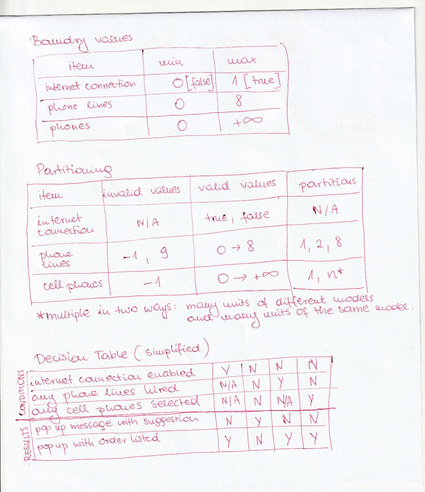
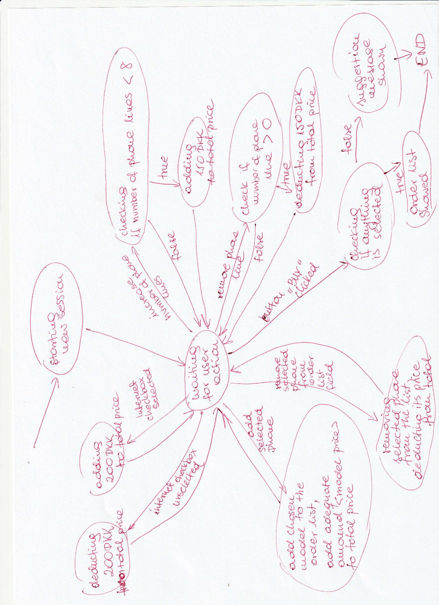

# KEANet

Online shopping application for a phone company KEANet.

User interface is clear and simple, it contains:

1. Checkbox for rhe internet connection service,

2. Input field for number of phone lines, 

3. Two fields for the cell phones, where:
	
    - one lists all available cell phone models,
	- second one empty by default, which is populated when phone names as cell phones are added.
	
	- Between cell phone fields there are two small buttons, 
	- placed vertically, one titled ">", that adds selected phone to the empty by dafault field. Second one named "<" removes selected phone from that field and it's placed below the first button.
	
4. 	Under above-mentioned elements total price (in DKK) is showed.
	Total price shall be updated in real time.
	Below presented sum, button titled "Buy" is placed.

Ad.1) Checkbox is not selected by default, if selected, total price increase by 200.

Ad.2) By default set to 0. Value can be modified (increment/decrement) in range 0-8. Meaning that client can hire maximum of 8 phone lines. Each costs 150DKK. 

Ad.3) Phone names to be included (when adding certain model total price should be raised by the amount that follows after dash):

- "Motorola G99" - 800,
- "iPone 99" - 6000,
- "Samsung Galaxy 99" - 1000,
- "Sony Xperia 99" - 800,
- "Huawei 99" - 800.
		
Multiple units of the same cell phone models can be added.

